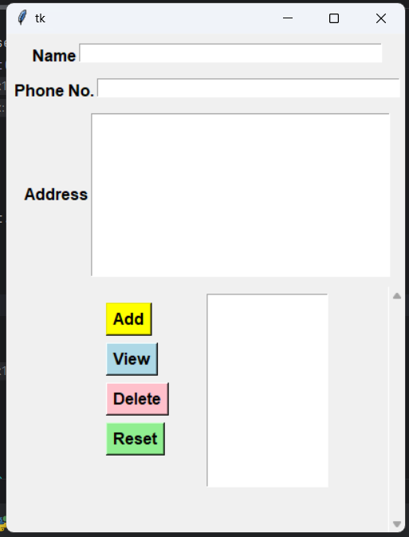
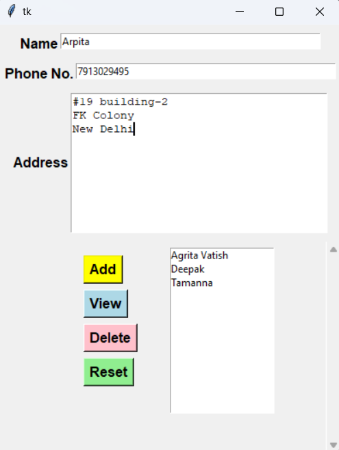
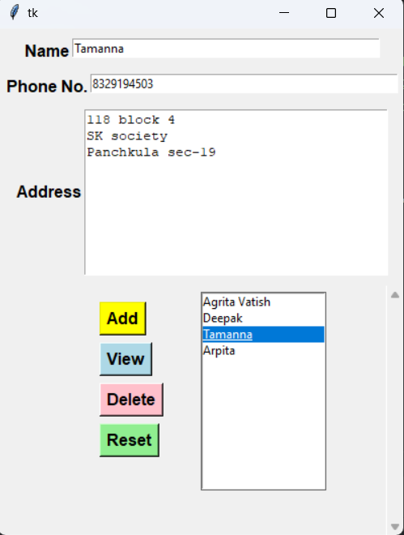

OVERVIEW:
The Python Phonebook Project is a user-friendly contact management application developed using the Tkinter library. The primary aim of this project is to provide a simple and efficient way for users to store, manage, and retrieve contact information, including names, phone numbers, and addresses.

KEY FEATURES: 
1.	User Interaction: The application is designed to facilitate easy interaction with users through a graphical user interface (GUI). Users can input contact details via text fields and buttons, making the process intuitive and straightforward.
2.	Data Management: The project allows users to:
•	Add Contacts: Users can enter new contact information and save it to the phonebook.
•	View Contacts: Users can select a contact from the list to view its details, which are displayed in the input fields for easy editing.
•	Delete Contacts: Users can remove unwanted contacts from the list, ensuring that their phonebook remains organized and up-to-date.
•	Reset Fields: Users can clear all input fields to start fresh, enhancing usability.
3.	Efficient Storage: The contact information is stored in a list structure (datas), which allows for efficient retrieval and manipulation of data. Each contact is represented as a sub-list containing the name, phone number, and address.
4.	Dynamic Updates: The application dynamically updates the contact list displayed in the GUI whenever a user adds or deletes a contact. This real-time feedback ensures that users are always aware of the current state of their phonebook.
5.	Educational Tool: This project serves as an educational example for beginners learning Python and GUI development. It demonstrates essential programming concepts such as event-driven programming, data handling, and the use of libraries to create interactive applications.

ALGORITHM/STEPS:
1.	Set Up the Environment:
•	Use any platform such PyCharm, VSCode or Jupyter
•	Ensure Tkinter is available (if not, then install it using pip install tkinter)

2.	Create the Main Application Window:
•	Initialize the main Tkinter window.
•	Set a title for the window (e.g., "Phonebook").

3.	Design the User Interface:
•	Add input fields for:
•	Name
•	Phone Number
•	Address
•	Create buttons for the following actions:
•	Add Contact
•	View Selected Contact
•	Delete Contact
•	Reset Fields
•	Create a listbox to display the contacts.
•	Add a scrollbar for the listbox for better navigation.

4.	Implement Functionality:
•	Add Contact:
Write a function to capture input from the fields and add it to the contact list.
•	View Selected Contact:
Write a function to populate the input fields with the selected contact's details when clicked.
•	Delete Contact:
Write a function to remove the selected contact from the list and update the display.
•	Reset Fields:
Write a function to clear all input fields for new entries.

5.	Update the Listbox Dynamically:
•	Ensure that the listbox updates automatically when contacts are added or deleted.

6.	Testing:
•	Test each functionality (adding, viewing, deleting, and resetting) to ensure they work as expected.
•	Check for edge cases, such as adding duplicate contacts or deleting from an empty list.

7.	Documentation:
•	Write comments in the code for clarity.

8.	Final Review:
•	Review the code for any improvements or optimizations.
•	Ensure the user interface is intuitive and user-friendly.

OUTPUT:
1. Phonebook window-

   

2. Input details in phonebook

1[Input details in phonebook](input_details.png)

3. Add button in phonebook-

4. View button in phonebook-

5. Delete button in phonebook-

